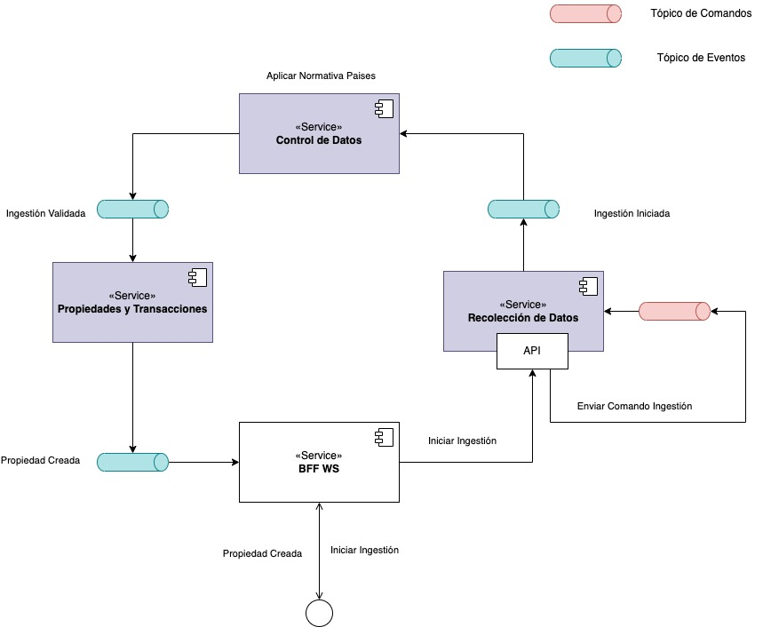

# Mock service

Servicio MOCK para probar el uso de CQRS con Apache Pulsar.

## Arquitectura

La arquitectura de este proyecto puede ser observada en el siguiente diagrama:



## Requisitos

- [Docker](https://www.docker.com/)
- [Docker Compose](https://docs.docker.com/compose/)
- [Python 3.10](https://www.python.org/)

## Despliegue

### Pulsar

Con este comando se levantan los servicios de Apache Pulsar y Zookeeper.

```bash
docker-compose --profile pulsar up
```

### PDA Servicios

Con este comando se levantam los servicios de
- Data Collection junto con su base de datos (PostgreSQL)
- Data Control junto con su base de datos (PostgreSQL)
- Properties and Transactions junto con su base de datos (PostgreSQL)

```bash
docker-compose --profile propiedades up
```

### BFF

con este comando se levanta el servicio de BFF
```bash
docker-compose --profile bff up
```

### Watcher

Con este comando se levanta el servicio de Watcher, que se encarga de consumir los eventos de Integración generados
por Data Collection.

```bash
docker-compose --profile watcher up
```

## Pruebas

Se pueden realizar pruebas de los servicios utilizando el comando `curl` o cualquier herramienta para realizar
peticiones. También se agregó una colección de Postman para realizar pruebas, que se encuentra en el directorio
[`./docs/entrega_4.postman_collection.json`](./docs/entrega_4.postman_collection.json).

### Generar ingestión

Para generar una ingestión de datos, se puede ejecutar el siguiente comando:

```bash
curl --location 'http://localhost:5000/ingestion/async' \
    --header 'Content-Type: application/json' \
    --header 'Cookie: session=eyJ1b3ciOnsiIGIiOiJnQVNWVHdBQUFBQUFBQUNNSG5OeVl5NWtZWFJoWDJOdmJHeGxZM1JwYjI0dVkyOXVabWxuTG5WdmQ1U01GRk5SVEVGc1kyaGxiWGxWYm1sMFQyWlhiM0pybEpPVUtZR1VmWlNNQ0Y5aVlYUmphR1Z6bEYyVWMySXUifX0.Zd0d5A.qu8UKqrCPZYfN_VF8y-VpxEkINQ' \
    --data '{
      "agent_id": "bhenaoc",
      "location": "Your property location",
      "property_type": "Your property type",
      "property_subtype": "Your property subtype",
      "rooms": 0,
      "bathrooms": 0,
      "parking_spaces": 0,
      "construction_area": 0,
      "land_area": 0,
      "price": 0,
      "currency": "Currency type (e.g., USD, EUR)",
      "price_per_m2": 0,
      "price_per_ft2": 0,
      "property_url": "URL to the property listing",
      "property_images": "URL to image 1"
    }
    '
```

### Consultar ingestiones

Para consultar las ingestiones generadas, se puede ejecutar el siguiente comando:

```bash
curl --location --request GET 'http://localhost:5000/ingestion'
```

### Crear Agentes autorizados

El agente autorizado es el encargado de generar comandos de creación de ingestiones automáticamente (cada 5 segundos),
utilizando datos de prueba (Faker).

Para crear un agente autorizado, se puede ejecutar el siguiente comando:

```bash
curl --location 'http://localhost:5000/agent/automation' \
    --header 'Content-Type: application/json' \
    --header 'Cookie: session=eyJ1b3ciOnsiIGIiOiJnQVNWVHdBQUFBQUFBQUNNSG5OeVl5NWtZWFJoWDJOdmJHeGxZM1JwYjI0dVkyOXVabWxuTG5WdmQ1U01GRk5SVEVGc1kyaGxiWGxWYm1sMFQyWlhiM0pybEpPVUtZR1VmWlNNQ0Y5aVlYUmphR1Z6bEYyVWMySXUifX0.Zd0c2g.O2L7mFmpMy-4reYjMe3GtQbZcx8' \
    --data '{
        "creator_name": {
            "first_name": "Miso",
            "last_name": "Team"
        },
        "automation":{
            "source": "URL",
            "protocol": "HTTP",
            "port": "80",
            "auth":{
                "username":"foo",
                "password":"bar"
            },
            "frequency":{
                "unit": "seconds",
                "value": 10
            }
        }
    }'
```

## Autores

- [Erik Fernando Loaiza Patiño](https://github.com/erikloaiza)
- [Brayan Henao](https://github.com/brayanhenao)
- [Felipe Cerquera](https://github.com/pipeCer)
- [Rodrigo Escobar Lopez](https://github.com/ocralo)

## Entrega 4

### Trabajo Realizado para entrega 4

- Configuración de pulsar y zookeeper en docker-compose
- Configuración de postgres en docker-compose
- Configuración de watcher en docker-compose
- Configuración de data collection en docker-compose
- Configuración de NGINX en docker-compose
- Creación de agentes autorizados
- Creación de ingestion de propiedades
- Configuración de validación de datos
- Subscripción a eventos de integración
- Pruebas de los servicios

### Escenarios de calidad probados
| Escenario #: 3                                               | El sistema se adapta y escala en respuesta a un incremento significativo en el volumen de transacciones inmobiliarias, garantizando la eficiencia y la continuidad del servicio                                                                                                                                                                                                                                                                                                                                                                                                                           |                                                                                                                                                       |         |
|--------------------------------------------------------------| --------------------------------------------------------------------------------------------------------------------------------------------------------------------------------------------------------------------------------------------------------------------------------------------------------------------------------------------------------------------------------------------------------------------------------------------------------------------------------------------------------------------------------------------------------------------------------------------------------- |-------------------------------------------------------------------------------------------------------------------------------------------------------|---------|
| Fuente                                                       | Clientes y sistema interno de procesamiento de transacciones                                                                                                                                                                                                                                                                                                                                                                                                                                                                                                                                              |                                                                                                                                                       |         |
| Estímulo                                                     | Incremento sustancial en el volumen de transacciones inmobiliarias procesadas, como podría ocurrir durante un boom inmobiliario o un período de inversión intensiva                                                                                                                                                                                                                                                                                                                                                                                                                                       |                                                                                                                                                       |         |
| Ambiente                                                     | Operación normal durante un pico de actividad del mercado                                                                                                                                                                                                                                                                                                                                                                                                                                                                                                                                                 |                                                                                                                                                       |         |
| Artefacto                                                    | Sistema de Propiedades y Transacciones                                                                                                                                                                                                                                                                                                                                                                                                                                                                                                                                                                    |                                                                                                                                                       |         |
| Respuesta                                                    | El sistema escala dinámicamente para manejar el aumento en la carga de transacciones, asegurando que el procesamiento de datos y la generación de resultados se mantengan dentro de los umbrales de rendimiento aceptables.                                                                                                                                                                                                                                                                                                                                                                               |                                                                                                                                                       |         |
| Medida de la respuesta                                       | Capacidad para procesar hasta dos veces la cantidad de solicitudes respecto a la operación normal                                                                                                                                                                                                                                                                                                                                                                                                                                                                                                         |                                                                                                                                                       |         |
| Decisiones Arquitecturales                                   | Punto de sensibilidad                                                                                                                                                                                                                                                                                                                                                                                                                                                                                                                                                                                     | Tradeoff                                                                                                                                              | Riesgo  |
| Incremento de recursos: Redundancia activa de microservicios | El sistema aumenta el número de instancias que procesan las solicitudes del sistema de transacciones| Desincronización por parte de las instancias                                                                                                          | Sobrecosto por funcionamiento de las instancias redundantes. Incremento de recursos/costos debido a ataques (DoS, DDoS)
| CQRS                                                         | Separación de operaciones de lectura y escritura                                                                                                                                                                                                                                                                                                                                                                                                                                                                                                                                                           | Coordinación y coherencia entre el modelo de escritura y el de lectura, especialmente cuando se manejan transacciones que abarcan múltiples agregados | Incremento en la complejidad de la arquitectura que puede llevar a desafíos en la implementación y la posibilidad de inconsistencias temporales entre la escritura y la lectura |
| Justificación                                                | La utilización de redundancia activa y CQRS proporciona una base sólida para manejar el creciente volumen de transacciones inmobiliarias en Propiedades de Los Alpes. La redundancia activa de microservicios asegura la continuidad del servicio y la capacidad de respuesta, incluso bajo cargas extraordinarias, ofreciendo una experiencia de usuario constante. Paralelamente, CQRS mejora la gestión y el rendimiento de las operaciones de lectura y escritura al desacoplarlas, lo cual es esencial para mantener la integridad de los datos en un sistema con múltiples fuentes de actualización. |

| Escenario #: 4                 | Debido a la expansión del mercado, se requiere que la información esté disponible para cuando los clientes lo requieran                                                                                                                                                                                                                                                                                                                                                                                                         |                                             |         |
| ------------------------------ |---------------------------------------------------------------------------------------------------------------------------------------------------------------------------------------------------------------------------------------------------------------------------------------------------------------------------------------------------------------------------------------------------------------------------------------------------------------------------------------------------------------------------------|---------------------------------------------|---------|
| Fuente                         | Cliente                                                                                                                                                                                                                                                                                                                                                                                                                                                                                                                         |                                             |         |
| Estímulo                       | Consultar informe                                                                                                                                                                                                                                                                                                                                                                                                                                                                                                               |                                             |         |
| Ambiente                       | Operación normal                                                                                                                                                                                                                                                                                                                                                                                                                                                                                                                |                                             |         |
| Artefacto                      | Sistema de resultados                                                                                                                                                                                                                                                                                                                                                                                                                                                                                                           |                                             |         |
| Respuesta                      | El sistema debe retornar el informe al cliente                                                                                                                                                                                                                                                                                                                                                                                                                                                                                  |                                             |         |
| Medida de la respuesta         | El 99.99% del tiempo debe responder de forma correcta                                                                                                                                                                                                                                                                                                                                                                                                                                                                           |                                             |         |
| Decisiones Arquitecturales     | Punto de sensibilidad                                                                                                                                                                                                                                                                                                                                                                                                                                                                                                           | Tradeoff                                    | Riesgo  |
| Microservicios con redundancia | Desacoplamiento del sistema en servicios más pequeños que pueden estar desplegados en diferentes zonas geográficas                                                                                                                                                                                                                                                                                                                                                                                                              | Aumenta la complejidad y costos del sistema | Latencia en la comunicación        |
| Replicación de datos           | Coherencia de datos entre las réplicas                                                                                                                                                                                                                                                                                                                                                                                                                                                                                          | Incremento de costos de operación           |  Desincronización de los datos       |
| Justificación                  | La arquitectura basada en microservicios ofrece una flexibilidad excepcional gracias a su enfoque modular. Esto facilita el despliegue independiente de cada componente, fomentando un alto nivel de desacoplamiento entre ellos, por otro lado, el hecho de tener redundancia, disminuye el riesgo de tener un punto único de falla. Además, en caso de fallas en la base de datos principal, contamos con una réplica para garantizar la continuidad del servicio mientras se restaura la operatividad del sistema principal. |


| Escenario #: 7                      | PDA inicia operaciones en un nuevo mercado                                                                                                                                                                                                                                                                                                                                                                                                                                                                                                                                                                                           | ||
| ----------------------------------- |--------------------------------------------------------------------------------------------------------------------------------------------------------------------------------------------------------------------------------------------------------------------------------------------------------------------------------------------------------------------------------------------------------------------------------------------------------------------------------------------------------------------------------------------------------------------------------------------------------------------------------------| - | - |
| Fuente                              | Equipo de gestión de producto y legal                                                                                                                                                                                                                                                                                                                                                                                                                                                                                                                                                                                                | ||
| Estímulo                            | Ingreso a un nuevo mercado con diferentes leyes de manejo de datos y requerimientos de reporte                                                                                                                                                                                                                                                                                                                                                                                                                                                                                                                                       |||
| Ambiente                            | Cambios en el ambiente regulatorio o expansión a nuevos mercados                                                                                                                                                                                                                                                                                                                                                                                                                                                                                                                                                                     |||
| Artefacto                           | Sistema de control de datos                                                                                                                                                                                                                                                                                                                                                                                                                                                                                                                                                                                                          |||
| Respuesta                           | El sistema debe permitir la incorporación rápida de nuevas reglas de negocio y adaptaciones legales sin necesidad de una reescritura extensa del código, manteniendo la integridad y privacidad de los datos según las leyes locales                                                                                                                                                                                                                                                                                                                                                                                                 |||
| Medida de la respuesta              | Implementación de modificaciones legales y de mercado en menos de 4 semanas desde la solicitud, con un impacto mínimo en las operaciones actuales                                                                                                                                                                                                                                                                                                                                                                                                                                                                                    |||
| Decisiones Arquitecturales          | Punto de sensibilidad                                                                                                                                                                                                                                                                                                                                                                                                                                                                                                                                                                                                                | Tradeoff | Riesgo |
| Arquitectura Hexagonal              | Múltiples puertos de envío y recepción datos                                                                                                                                                                                                                                                                                                                                                                                                                                                                                                                                                                                         | Sobrecarga a nivel de abstracción | Sobre diseñar la arquitectura, haciendo que sea demasiado compleja de entender e implementar |
| Incrementar el nivel de abstracción | Alcanzar un nivel de abstracción suficiente que suplas condiciones de agregar un nuevo país con sus diferentes normas en la información requerida                                                                                                                                                                                                                                                                                                                                                                                                                                                                                    | Sobrecarga cognitiva en el modelo abstracto | Contar con un modelo demasiado abstracto que sea difícil de mantener y/o que no pueda suplir el 100% de los escenarios de los nuevos mercados. |
| Justificación                       | Gracias a la arquitectura hexagonal, logramos aislar el dominio de la aplicación y la infraestructura del sistema PDA. De igual manera, la implementación del patrón de inversión de dependencias, hemos logrado organizar nuestros modelos en tres capas distintas. Esta estructura garantiza que cada capa esté aislada y se comunique con las demás a través de puertos y adaptadores. Además, esta división nos ha facilitado la incorporación de un módulo de Normas Países en el paquete de Control de datos. Esto simplifica significativamente la tarea de ingresar a nuevos mercados, reduciendo la complejidad del proceso |

