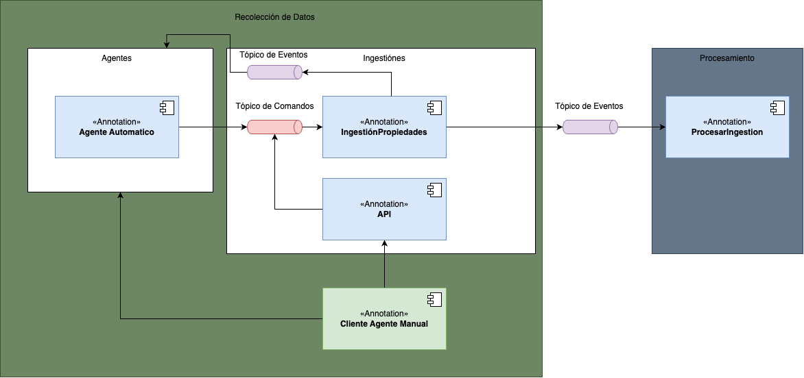

# Mock service

Servicio MOCK para probar el uso de CQRS con Apache Pulsar.

## Arquitectura

La arquitectura de este proyecto puede ser observada en el siguiente diagrama:



## Requisitos

- [Docker](https://www.docker.com/)
- [Docker Compose](https://docs.docker.com/compose/)
- [Python 3.10](https://www.python.org/)

## Despliegue

### Pulsar

Con este comando se levantan los servicios de Apache Pulsar y Zookeeper.

```bash
docker-compose --profile pulsar up
```

### Data Collection

Con este comando se levanta el servicio de Data Collection junto con su base de datos (PostgreSQL)

```bash
docker-compose --profile propiedades up
```

### Watcher

Con este comando se levanta el servicio de Watcher, que se encarga de consumir los eventos de Integración generados
por Data Collection.

```bash
docker-compose --profile watcher up
```

## Pruebas

Se pueden realizar pruebas de los servicios utilizando el comando `curl` o cualquier herramienta para realizar
peticiones. También se agregó una colección de Postman para realizar pruebas, que se encuentra en el directorio
[`./docs/entrega_3.postman_collection.json`](./docs/entrega_3.postman_collection.json).

### Generar ingestión

Para generar una ingestión de datos, se puede ejecutar el siguiente comando:

```bash
curl --location 'http://localhost:5000/ingestion/async' \
    --header 'Content-Type: application/json' \
    --header 'Cookie: session=eyJ1b3ciOnsiIGIiOiJnQVNWVHdBQUFBQUFBQUNNSG5OeVl5NWtZWFJoWDJOdmJHeGxZM1JwYjI0dVkyOXVabWxuTG5WdmQ1U01GRk5SVEVGc1kyaGxiWGxWYm1sMFQyWlhiM0pybEpPVUtZR1VmWlNNQ0Y5aVlYUmphR1Z6bEYyVWMySXUifX0.Zd0d5A.qu8UKqrCPZYfN_VF8y-VpxEkINQ' \
    --data '{
      "agent_id": "bhenaoc",
      "location": "Your property location",
      "property_type": "Your property type",
      "property_subtype": "Your property subtype",
      "rooms": 0, 
      "bathrooms": 0, 
      "parking_spaces": 0, 
      "construction_area": 0, 
      "land_area": 0, 
      "price": 0, 
      "currency": "Currency type (e.g., USD, EUR)",
      "price_per_m2": 0, 
      "price_per_ft2": 0, 
      "property_url": "URL to the property listing",
      "property_images": "URL to image 1" 
    }
    '
```

### Consultar ingestiones

Para consultar las ingestiones generadas, se puede ejecutar el siguiente comando:

```bash
curl --location --request GET 'http://localhost:5000/ingestion'
```

### Crear Agentes autorizados

El agente autorizado es el encargado de generar comandos de creación de ingestiones automáticamente (cada 5 segundos),
utilizando datos de prueba (Faker).

Para crear un agente autorizado, se puede ejecutar el siguiente comando:

```bash
curl --location 'http://localhost:5000/agent/automation' \
    --header 'Content-Type: application/json' \
    --header 'Cookie: session=eyJ1b3ciOnsiIGIiOiJnQVNWVHdBQUFBQUFBQUNNSG5OeVl5NWtZWFJoWDJOdmJHeGxZM1JwYjI0dVkyOXVabWxuTG5WdmQ1U01GRk5SVEVGc1kyaGxiWGxWYm1sMFQyWlhiM0pybEpPVUtZR1VmWlNNQ0Y5aVlYUmphR1Z6bEYyVWMySXUifX0.Zd0c2g.O2L7mFmpMy-4reYjMe3GtQbZcx8' \
    --data '{
        "creator_name":{
            "first_name": "Miso",
            "last_name": "Team"
        },
        "automation":{
            "source": "URL",
            "protocol": "HTTP",
            "port": "80",
            "auth":{
                "username":"foo",
                "password":"bar"
            },
            "frequency":{
                "unit": "seconds",
                "value": 10
            }
        }
    }'
```
